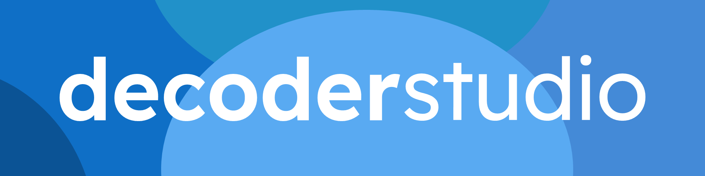

Welcome to **Decoder Studio**, a free, open sourced decoder meant for decoding animatronic signals from Studio C and more. Before using this application, please read below.
# Features
- **Translation** of bits to English
- **Video Support**
- **Easy to use UI**
- Lots more!
# Quick Installation
Go to https://github.com/realrandombeans/Decoder-Studio/releases and go to the latest release, download the setup and install the software. You should be all set!
# License
This project is licensed under the GNU General Public License v3. More information available [here](LICENSE)
